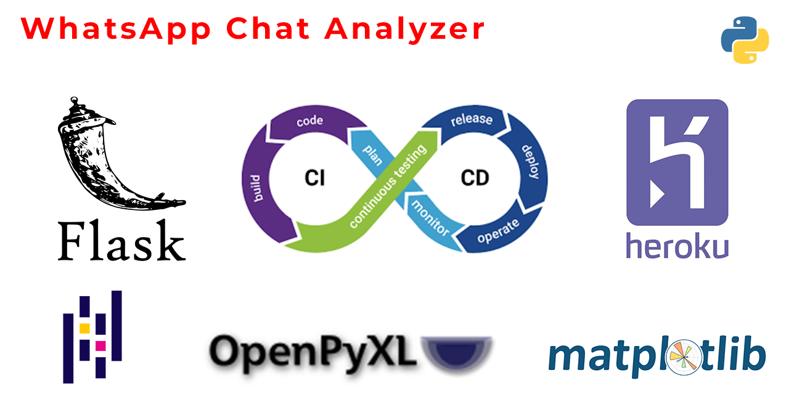

# WhatsApp Chat Analyzer

WhatsApp Chat Analyzer is a Flask-based web application that processes exported WhatsApp chat files, analyzes them, and generates insightful metrics. It supports conversion of chat files into structured formats (CSV, Excel) and provides data visualizations such as pie charts for message distribution and average reply times.

Live-web Application

https://whatssap-chat-analyzer-aceff0b3611b.herokuapp.com/

[Watch My YouTube Video](https://www.youtube.com/watch?v=XHe_vNL7i_E)

## Features

- **WhatsApp Chat Parsing**: Automatically parses WhatsApp chat exports, detecting messages, senders, and timestamps.
- **Data Export**: Outputs processed chat data as CSV and Excel files.
- **Analytics**:
  - Message count per sender
  - Average reply time per sender
- **Data Visualization**: Generates pie charts to visualize:
  - Distribution of total messages per sender
  - Average reply times per sender


## Technologies Used



- **Flask**: Backend web framework
- **Pandas**: Data processing and analysis
- **Matplotlib**: Data visualization for generating charts
- **OpenPyXL**: To create Excel files with charts embedded
- **Heroku**: Deployment platform for the application


## Prerequisites

To run this project locally, you will need:

- Python 3.9+
- A virtual environment setup tool like `venv` or `virtualenv`
- A WhatsApp chat export file (.txt format)

## Installation

1. Clone the repository:

```bash
    git clone https://github.com/onurcangnc/whatsapp_chat_analyzer.git
    cd whatsapp_chat_analyzer
```

2. Set up a virtual environment:

```bash
    python3 -m venv venv
    source venv/bin/activate  # For Windows: venv\Scripts\activate
```

3. Install the required packages:

```bash
    pip install -r requirements.txt
```

4. Create a .env file to set the Flask secret key:

```bash
    FLASK_SECRET_KEY=your_secret_key
```

```bash
python -c 'import os; print(os.urandom(24).hex())'
```

5. Run the Flask application:

```bash
flask run
```

6. Open your browser and visit:

```bash
127.0.0.1:5000
```


---

## Usage

### Uploading Chat Files

- Export the chat file from WhatsApp and upload the `.txt` file via the web interface.
- The system will parse the chat and generate a downloadable CSV or Excel file containing the analysis.

### Output Files

- **CSV**: The processed chat data.
- **Excel**: Processed data with embedded pie charts of message distribution and reply times.

### Available Analytics

- **Total Messages per Sender**: Counts how many messages each person sent in the conversation.
- **Average Reply Time**: Calculates the average time it takes each person to reply.


## Deployment

The project is already set up for Heroku deployment. You can deploy it to Heroku with the following steps:

1. Create a Heroku account and install the Heroku CLI.
2. Log in to Heroku:

```bash
   heroku login
```

3. Create a new Heroku app:

```bash
heroku create your-app-name
```

4. Push the code to Heroku:

```bash
    git push heroku main
```

5. Open the app:

```bash
heroku open
```


---

## CI/CD Pipeline

- This project uses GitHub Actions for continuous integration and deployment to Heroku. The CI/CD pipeline will run automatically on each push to the `main` branch, deploying the app to Heroku.


## Contributing

1. Fork the repository.
2. Create a new branch (`git checkout -b feature-branch`).
3. Make your changes and commit them (`git commit -m "Add new feature"`).
4. Push to the branch (`git push origin feature-branch`).
5. Open a pull request.


## License

This project is licensed under the MIT License. See the `LICENSE` file for more details.

## Contact

For any inquiries or issues, please feel free to reach out.

- **Email**: [onurcangencbilkent@gmail.com](mailto:onurcangencbilkent@gmail.com)
- **GitHub**: [onurcangnc](https://github.com/onurcangnc)
